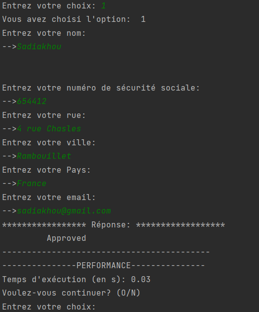

# python-soa

---

Here's some screenshots of the application:

> By running the `main.py` file in services_app, the server application is then run on the port 8000.

- Console output of the server app:

---
> By running the `main.py` file in client_app, the client application is then run.
- Console output of the client app:
- - main menu:

- - checking solvability:

- - Checking appraisal:

- - Checking approval:
